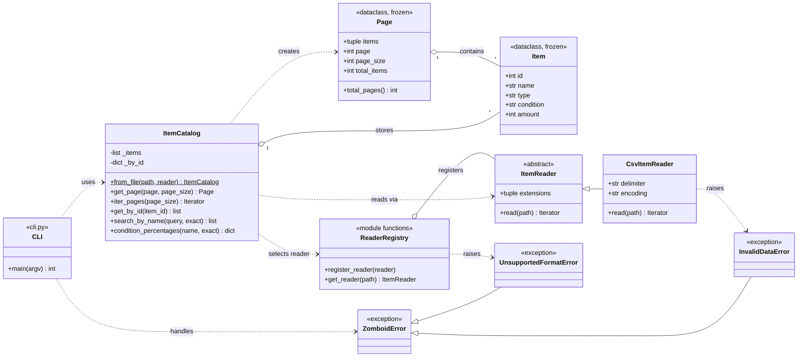

# Class Diagram

```mermaid
classDiagram
    direction LR

    class Item {
        <<dataclass, frozen>>
        +int id
        +str name
        +str type
        +str condition
        +int amount
    }

    class Page {
        <<dataclass, frozen>>
        +tuple items
        +int page
        +int page_size
        +int total_items
        +total_pages() int
    }

    class ItemReader {
        <<abstract>>
        +tuple extensions
        +read(path) Iterator
    }

    class CsvItemReader {
        +str delimiter
        +str encoding
        +read(path) Iterator
    }

    class ItemCatalog {
        -list _items
        -dict _by_id
        +from_file(path, reader)$ ItemCatalog
        +get_page(page, page_size) Page
        +iter_pages(page_size) Iterator
        +get_by_id(item_id) list
        +search_by_name(query, exact) list
        +condition_percentages(name, exact) dict
    }

    class ReaderRegistry {
        <<module functions>>
        +register_reader(reader)
        +get_reader(path) ItemReader
    }

    class ZomboidError {
        <<exception>>
    }
    class InvalidDataError {
        <<exception>>
    }
    class UnsupportedFormatError {
        <<exception>>
    }

    class CLI {
        <<cli.py>>
        +main(argv) int
    }

    ItemReader <|-- CsvItemReader
    ZomboidError <|-- InvalidDataError
    ZomboidError <|-- UnsupportedFormatError

    ItemCatalog "1" o-- "*" Item : stores
    Page "1" o-- "*" Item : contains
    ItemCatalog ..> Page : creates
    ItemCatalog ..> ReaderRegistry : selects reader
    ItemCatalog ..> ItemReader : reads via
    ReaderRegistry o-- ItemReader : registers
    ReaderRegistry ..> UnsupportedFormatError : raises
    CsvItemReader ..> InvalidDataError : raises
    CLI ..> ItemCatalog : uses
    CLI ..> ZomboidError : handles
```
